# 📁 Estructura del Proyecto

## Diagrama Visual

```mermaid
graph TD
    A["📁 SerpientesScaleras"]
    
    A --> B1["📁 pages/"]
    A --> B2["📁 components/"]
    A --> B3["📁 lib/"]
    A --> B4["📁 utils/"]
    A --> B5["📁 layouts/"]
    A --> B6["📁 assets/"]
    
    B1 --> B1a["index.astro 🏠"]
    B1 --> B1b["Setup.astro ⚙️"]
    B1 --> B1c["Alpha.astro 🎮"]
    B1 --> B1d["Beta.astro 🎮"]
    
    B2 --> B2a["navbar.astro"]
    B2 --> B2b["Ruleta.astro 🎲"]
    B2 --> B2c["RuletaRetroceso.astro"]
    B2 --> B2d["TableroMapa.astro 🗺️"]
    B2 --> B2e["ModalAlpha.astro"]
    B2 --> B2f["ModalBeta.astro"]
    B2 --> B2g["reglas.astro 📋"]
    B2 --> B2h["footer.astro"]
    
    B3 --> B3a["turnManager.ts 🎯"]
    
    B4 --> B4a["audioController.ts 🔊"]
    B4 --> B4b["fracGeo.ts 📐"]
    B4 --> B4c["mathgenerator.ts 🧮"]
    
    B5 --> B5a["Layout.astro"]
    
    B6 --> B6a["styles.css"]
    B6 --> B6b["sonidos/"]
```



## Descripción por Carpeta

| Carpeta | Propósito |
|---------|-----------|
| `pages/` | Páginas principales del juego (Home, Setup, Modo Alpha, Modo Beta) |
| `components/` | Componentes reutilizables (Ruleta, Tablero, Modales, etc.) |
| `lib/` | Lógica de negocio (TurnManager para gestión de turnos) |
| `utils/` | Funciones auxiliares (generación de problemas, audio, geometría) |
| `layouts/` | Plantilla base para todas las páginas |
| `assets/` | Recursos estáticos (CSS, sonidos) |
| `public/` | Archivos públicos (favicon, etc.) |

## Código para MermaidLive

Copia este código en [mermaid.live](https://mermaid.live):

```
graph TD
    A["📁 SerpientesScaleras"]
    
    A --> B1["📁 pages/"]
    A --> B2["📁 components/"]
    A --> B3["📁 lib/"]
    A --> B4["📁 utils/"]
    A --> B5["📁 layouts/"]
    A --> B6["📁 assets/"]
    
    B1 --> B1a["index.astro 🏠"]
    B1 --> B1b["Setup.astro ⚙️"]
    B1 --> B1c["Alpha.astro 🎮"]
    B1 --> B1d["Beta.astro 🎮"]
    
    B2 --> B2a["navbar.astro"]
    B2 --> B2b["Ruleta.astro 🎲"]
    B2 --> B2c["RuletaRetroceso.astro"]
    B2 --> B2d["TableroMapa.astro 🗺️"]
    B2 --> B2e["ModalAlpha.astro"]
    B2 --> B2f["ModalBeta.astro"]
    B2 --> B2g["reglas.astro 📋"]
    B2 --> B2h["footer.astro"]
    
    B3 --> B3a["turnManager.ts 🎯"]
    
    B4 --> B4a["audioController.ts 🔊"]
    B4 --> B4b["fracGeo.ts 📐"]
    B4 --> B4c["mathgenerator.ts 🧮"]
    
    B5 --> B5a["Layout.astro"]
    
    B6 --> B6a["styles.css"]
    B6 --> B6b["sonidos/"]
```
