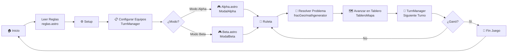

# 🎮 Flujo del Juego

## Diagrama de Flujo Principal



## Fases del Juego

1. **Inicio**: El jugador ve la pantalla de bienvenida
2. **Reglas**: Lee las instrucciones del juego
3. **Setup**: Configura los equipos y jugadores
4. **Selección de Modo**: Elige entre Modo Alpha o Beta
5. **Tirada**: Usa la ruleta para obtener un número
6. **Desafío**: Resuelve un problema matemático/geométrico
7. **Avance**: Mueve su ficha en el tablero
8. **Turno**: Pasa al siguiente equipo/jugador
9. **Victoria**: Cuando alguien llega al final

## Código para MermaidLive

```
graph LR
    A["🏠 Inicio"] --> B["Leer Reglas<br/>reglas.astro"]
    B --> C["⚙️ Setup"]
    C --> D["📋 Configurar Equipos<br/>TurnManager"]
    D --> E{"¿Modo?"}
    E -->|Modo Alpha| F["🎮 Alpha.astro<br/>ModalAlpha"]
    E -->|Modo Beta| G["🎮 Beta.astro<br/>ModalBeta"]
    F --> H["🎲 Ruleta"]
    G --> H
    H --> I["📐 Resolver Problema<br/>fracGeo/mathgenerator"]
    I --> J["🗺️ Avanzar en Tablero<br/>TableroMapa"]
    J --> K["🎯 TurnManager<br/>Siguiente Turno"]
    K --> L{"¿Ganó?"}
    L -->|No| H
    L -->|Sí| M["🎉 Fin Juego"]
    M --> A
```
