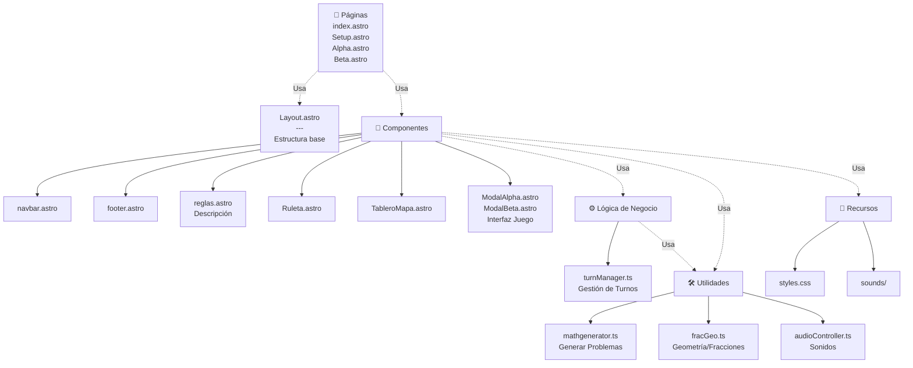

# 🏗️ Arquitectura del Proyecto

## Diagrama de Componentes



## Capas de la Arquitectura

| Capa | Componentes | Responsabilidad |
|------|-------------|-----------------|
| **Presentación** | Pages, Components | Interfaz de usuario, renderizado |
| **Lógica** | TurnManager | Gestión de turnos y estado del juego |
| **Utilidades** | mathgenerator, fracGeo, audioController | Funciones reutilizables |
| **Recursos** | CSS, Sonidos | Estilos y multimedia |

## Flujo de Datos

1. **Usuario interactúa** con componentes (Ruleta, Botones)
2. **Componentes** llaman a utilidades (mathgenerator, audioController)
3. **TurnManager** gestiona el estado del juego (equipos, rondas)
4. **Actualización** refleja cambios en UI

## Código para MermaidLive

```
graph TB
    Layout["Layout.astro<br/>---<br/>Estructura base"]
    
    Pages["📄 Páginas<br/>index.astro<br/>Setup.astro<br/>Alpha.astro<br/>Beta.astro"]
    
    Components["🧩 Componentes"]
    Components --> C1["navbar.astro"]
    Components --> C2["footer.astro"]
    Components --> C3["reglas.astro<br/>Descripción"]
    Components --> C4["Ruleta.astro"]
    Components --> C5["TableroMapa.astro"]
    Components --> C6["ModalAlpha.astro<br/>ModalBeta.astro<br/>Interfaz Juego"]
    
    Logic["⚙️ Lógica de Negocio"]
    Logic --> L1["turnManager.ts<br/>Gestión de Turnos"]
    
    Utils["🛠️ Utilidades"]
    Utils --> U1["mathgenerator.ts<br/>Generar Problemas"]
    Utils --> U2["fracGeo.ts<br/>Geometría/Fracciones"]
    Utils --> U3["audioController.ts<br/>Sonidos"]
    
    Assets["🎨 Recursos"]
    Assets --> A1["styles.css"]
    Assets --> A2["sounds/"]
    
    Pages -.->|Usa| Layout
    Pages -.->|Usa| Components
    Components -.->|Usa| Logic
    Components -.->|Usa| Utils
    Components -.->|Usa| Assets
    Logic -.->|Usa| Utils
```
