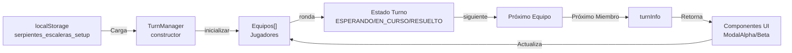

# 🔄 Flujo de Datos del Juego

## TurnManager y Estado



## Estructura de Datos - Team Interface

```typescript
interface Team {
  id: number;
  name: string;
  avatar: string;
  members: string[];
  colorClass: string;
  hexColor: string;
}
```

## Estado de Turno

```typescript
type EstadoTurno = 'ESPERANDO' | 'EN_CURSO' | 'RESUELTO';

interface TurnInfo {
  equipo: Team;
  miembro: string;
  estado: EstadoTurno;
  ronda: number;
}
```

## Ciclo de un Turno

1. **ESPERANDO**: Turno no iniciado
2. **EN_CURSO**: Jugador resolviendo desafío
3. **RESUELTO**: Desafío completado, avanza
4. **SIGUIENTE**: Pasa al siguiente equipo

## Flujo de localStorage

```
Setup.astro
    ↓
Usuario configura equipos
    ↓
JSON guardado en localStorage
    ↓
"serpientes_escaleras_setup"
    ↓
TurnManager.inicializar()
    ↓
Carga equipos y miembros
    ↓
Juego comienza
```

## Código para MermaidLive

```
graph LR
    A["localStorage<br/>serpientes_escaleras_setup"] -->|Carga| B["TurnManager<br/>constructor"]
    B -->|inicializar| C["Equipos[]<br/>Jugadores"]
    C -->|ronda| D["Estado Turno<br/>ESPERANDO/EN_CURSO/RESUELTO"]
    D -->|siguiente| E["Próximo Equipo"]
    E -->|Próximo Miembro| F["turnInfo"]
    F -->|Retorna| G["Componentes UI<br/>ModalAlpha/Beta"]
    G -->|Actualiza| C
```
