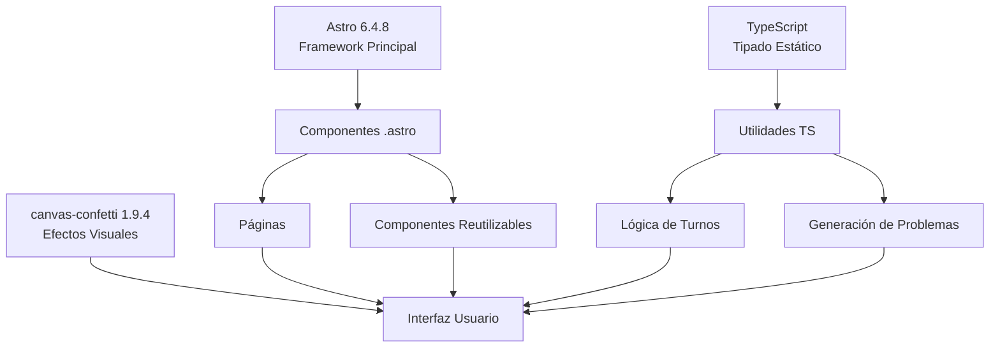

# 📦 Dependencias y Librerías

## Diagrama de Dependencias



## Stack Tecnológico

### Framework & Runtime
- **Astro 6.4.8** - Framework moderno para sitios web rápidos
- **Node.js >= 22.12.0** - Runtime de JavaScript
- **TypeScript** - Lenguaje tipado

### Librerías
- **canvas-confetti 1.9.4** - Efectos visuales (confeti)
- **@types/canvas-confetti 1.9.0** - Tipos para TypeScript

### Herramientas
- **pnpm** - Gestor de paquetes (más eficiente que npm)
- **Astro CLI** - Comandos de desarrollo

## Scripts Disponibles

```json
{
  "dev": "astro dev",           // Inicia servidor de desarrollo
  "build": "astro build",       // Compila para producción
  "preview": "astro preview",   // Previsualiza build
  "astro": "astro"              // CLI de Astro
}
```

## Instalación de Dependencias

```bash
# Instalar todas las dependencias
pnpm install

# Instalar un paquete nuevo
pnpm add nombre-paquete

# Instalar devDependency
pnpm add -D nombre-paquete
```

## Versiones Requeridas

| Tecnología | Versión | Tipo |
|------------|---------|------|
| Node.js | >= 22.12.0 | Runtime |
| Astro | ^6.4.8 | Framework |
| TypeScript | - | Lenguaje |
| canvas-confetti | ^1.9.4 | Librería |

## Código para MermaidLive

```
graph TD
    Astro["Astro 6.4.8<br/>Framework Principal"]
    TS["TypeScript<br/>Tipado Estático"]
    Confetti["canvas-confetti 1.9.4<br/>Efectos Visuales"]
    
    Astro --> Components["Componentes .astro"]
    TS --> Utils["Utilidades TS"]
    Confetti --> UI["Interfaz Usuario"]
    
    Components --> Pages["Páginas"]
    Components --> Widgets["Componentes Reutilizables"]
    
    Utils --> TurnLogic["Lógica de Turnos"]
    Utils --> MathLogic["Generación de Problemas"]
    
    Pages --> UI
    Widgets --> UI
    TurnLogic --> UI
    MathLogic --> UI
```
